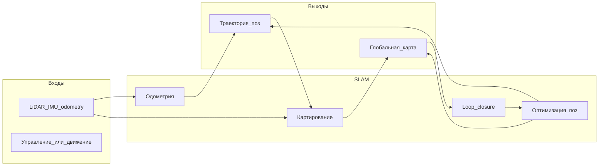

# Основы SLAM и лидарная постановка задачи

## Что такое SLAM

**SLAM** (Simultaneous Localization and Mapping) — одновременная **локализация** (оценка положения и ориентации датчика/робота) и **построение карты** окружающей среды по измерениям сенсоров.

Ключевая трудность: чтобы построить карту, нужно знать, *где* был датчик в момент каждого измерения; чтобы узнать положение, нужна *карта* или опорная геометрия. Эти две задачи решаются **совместно**, итеративно уточняя и позу, и карту.

## Состояние системы

В типичной лидарной SLAM-системе оценивают:

| Переменная | Смысл |
|------------|--------|
| **Поза** | Положение и ориентация датчика в мировой СК: обычно $\mathrm{SE}(3)$ — вектор трансляции + кватернион или матрица $4 \times 4$ |
| **Карта** | Представление среды: облако точек, воксельная occupancy-сетка, surfel-модель, pose graph и т.д. |
| **Траектория** | Последовательность поз $\{T_0, T_1, \ldots, T_n\}$ во времени |

## Два основных блока

### 1. LiDAR Odometry (одометрия)

Оценка **относительного движения** между соседними сканами (или между сканом и локальной подкартой):

- вход: облако точек в момент $t$ и $t+1$;
- выход: преобразование $\Delta T_{t \to t+1}$;
- накопление: $T_{t+1} = T_t \cdot \Delta T_{t \to t+1}$.

Одометрия даёт **локально точную**, но **глобально дрейфующую** траекторию: ошибки накапливаются без глобальных поправок.

### 2. Mapping (картирование)

**Накопление** измерений в единой системе координат:

- каждое облако трансформируется в мировую СК по текущей оценке позы;
- точки добавляются в глобальную карту (простое объединение, вокселизация, OctoMap).

Картирование может работать на той же частоте, что и одометрия, или реже (как в LOAM — см. [02-feature-based-slam.md](02-feature-based-slam.md)).

## Дрейф и loop closure

| Проблема | Описание | Типичное решение |
|----------|----------|------------------|
| **Дрейф одометрии** | Малые ошибки ICP/признаков суммируются по длинной траектории | Loop closure, глобальная оптимизация (pose graph, g2o, GTSAM) |
| **Loop closure** | Распознавание повторного посещения места | Сопоставление текущего скана/подкарты с ранее сохранённым фрагментом, добавление ребра в граф поз |
| **Динамические объекты** | Машины, пешеходы искажают статичную карту | Фильтрация, сегментация, робастные метрики |

Простые системы на ICP с накоплением облаков часто обходятся **без** loop closure; на длинных маршрутах дрейф становится заметным — тогда добавляют распознавание повторных визитов и глобальную оптимизацию.

## Классификация лидарных SLAM-подходов

В литературе и прикладных системах выделяют три семейства (подробнее — в отдельных файлах):

| Подход | Идея | Примеры |
|--------|------|---------|
| **Feature-based** | Выделить устойчивые геометрические признаки (рёбра, плоскости), сопоставлять их | LOAM, LeGO-LOAM, LIO-SAM |
| **Direct** | Минимизировать расстояние между сырыми/предобработанными точками или поверхностями | ICP, point-to-plane ICP, GICP, NDT |
| **Voxel-based** | Карта в виде занятости/расстояния в 3D-сетке (часто иерархической) | OctoMap, voxel hashing, TSDF |

На практике современные системы **комбинируют** элементы: например, воксельный downsample (PCL `VoxelGrid`) + ICP (direct) + pose graph (оптимизация).

## Особенности LiDAR в SLAM

### Формирование облака точек

- **Механический LiDAR** (Velodyne, Ouster): каждый «кадр» — набор лучей за один оборот или сегмент; точки измерены в **разное время** → при быстром движенении возникает **искажение** (motion distortion). LOAM и LIO-SAM явно компенсируют это; простой ICP на сырых KITTI-сканах часто работает на умеренных скоростях.
- **Координаты**: точки обычно в системе лидара; для сравнения с ground truth KITTI нужны **калибровочные** преобразования Velodyne → camera/world.

### Плотность и шум

- $10^4$–$10^5$ точек на скан — нужен **downsampling** (воксельная сетка) для скорости ICP.
- Выбросы, отражения от стекла/дождя — **статистические фильтры** (SOR в PCL).

### 6 DoF vs ограничения движения

Полная поза в 3D — 6 степеней свободы (3 трансляции + 3 вращения). На плоских дорожных сценах иногда фиксируют roll/pitch/z (3 DoF), как в LeGO-LOAM.

## Pose graph (кратко)

Для продвинутых систем карта — это не только точки, но и **граф поз**:

- **узлы** — позы в ключевых кадрах;
- **рёбра** — относительные преобразования (одометрия) или constraints от loop closure;
- **оптимизация** — минимизация суммы ошибок по рёбрам (ненаправленный нелинейный least squares).

Инструменты: g2o, GTSAM, Ceres. Базовый вариант SLAM может ограничиться последовательным накоплением поз по одометрии; pose graph добавляют, когда нужна глобальная согласованность.

## Наборы данных

### KITTI Odometry

- **Сайт:** https://www.cvlibs.net/datasets/kitti/eval_odometry.php
- **Данные:** последовательности `00`–`10` (обучение), `11`–`21` (тест); Velodyne `.bin`, калибровка, ground truth поз.
- **Формат `.bin`:** последовательность `float32`: `x, y, z, reflectivity` на точку, little-endian.

### Другие датасеты

| Датасет | Особенности |
|---------|-------------|
| **nuScenes** | Мультисенсор, автономное вождение, сложная разметка |
| **Ford Campus** | Лидар + GPS, кампус |
| **MulRan** | Мультисессии, loop closure, город/кампус |
| **Newer College** | Handheld LiDAR, сложная геометрия |

Для экспериментов часто берут одну последовательность KITTI (например, `00`) и сравнивают траекторию с `poses/00.txt`.

## Метрики качества

| Метрика | Что измеряет |
|---------|--------------|
| **ATE** (Absolute Trajectory Error) | Глобальное расхождение траектории с эталоном (после выравнивания $\mathrm{Sim}(3)$ или $\mathrm{SE}(3)$) |
| **RPE** (Relative Pose Error) | Ошибка относительных смещений на интервалах |
| **Визуально** | Совмещение облака с дорогой/зданиями, «двойные стены» при дрейфе |

## Краткие выводы

1. SLAM = одометрия + карта + при необходимости глобальная оптимизация.
2. Простая цепочка **препроцессинг → ICP между кадрами → накопление облака** — распространённый baseline для лидарных данных.
3. LOAM и OctoMap — характерные представители **feature-based** и **voxel-based** картирования.
4. KITTI Odometry — стандартный бенчмарк для количественной оценки одометрии.

## Литература

1. Durrant-Whyte H., Bailey T. Simultaneous localization and mapping: part I. *IEEE RAM*, 2006.
2. Cadena C. et al. Past, present, and future of simultaneous localization and mapping. *IEEE TRo*, 2016.
3. Zhang J., Singh S. LOAM: Lidar Odometry and Mapping in Real-time. *RSS*, 2014 — см. [02-feature-based-slam.md](02-feature-based-slam.md).
4. Geiger A. et al. Vision meets robotics: The KITTI dataset. *IJRR*, 2013.
