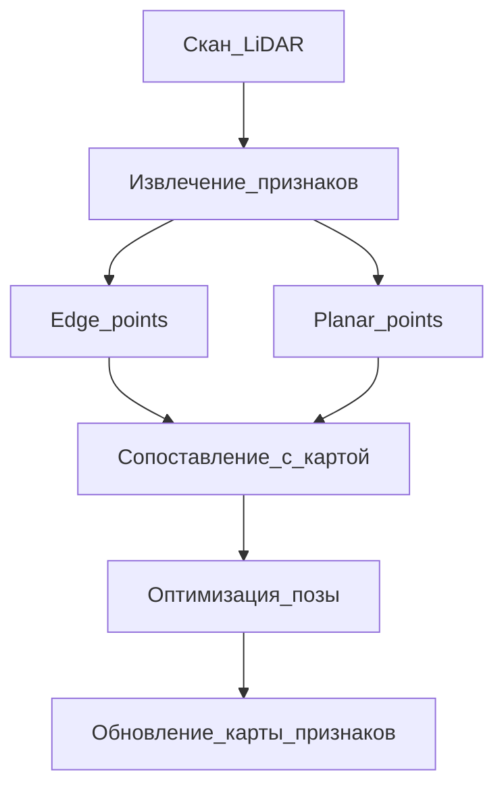

# Feature-based LiDAR SLAM

## Идея подхода

Вместо сопоставления **всех** точек двух облаков (как в ICP) выделяют **устойчивые геометрические признаки** — точки на острых рёбрах и на плоских поверхностях. Сопоставление ведёт по **структурированным примитивам** (отрезки, плоскости), что снижает число соответствий и часто ускоряет сходимость на структурированных сценах (коридоры, здания, дороги).

## LOAM (LiDAR Odometry and Mapping)

**Авторы:** Ji Zhang, Sanjiv Singh (CMU).  
**Публикация:** Robotics: Science and Systems (RSS), 2014.  
**Страница:** https://www.ri.cmu.edu/publications/loam-lidar-odometry-and-mapping-in-real-time/

### Архитектура

LOAM **разделяет** задачу на два контура с разной частотой:

| Модуль | Частота | Назначение |
|--------|---------|------------|
| **Lidar Odometry** | Высокая | Быстрая оценка движения, компенсация искажения скана при движении |
| **Lidar Mapping** | Низкая (порядка в 10 раз реже) | Точная подгонка к локальной карте из признаков |

Такое разделение снижает вычислительную нагрузку при сохранении точности, сравнимой с пакетными offline-методами на KITTI.

### Извлечение признаков (Feature Extraction)

Для каждой точки на развёртке скана оценивают **гладкость** (curvature) по соседним точкам вдоль луча/кольца:

- точки с **большой** кривизной → кандидаты в **edge points** (углы, контуры объектов);
- точки с **малой** кривизной → **planar points** (стены, пол, потолок).

Ограничения отбора (по статье):

- равномерное распределение признаков по углу обзора (на сектор — не более 2 edge и 4 planar точек);
- отсечение точек на границе окклюзий и «ненадёжных» краёв.

### Сопоставление и оптимизация

- **Edge point** сопоставляется с **линией** (два других edge point на карте).
- **Planar point** — с **локальной плоскостью** (патч planar points).

Минимизируется расстояние от точки до линии/плоскости (нелинейная least-squares по $\mathrm{SE}(3)$). В модуле mapping используется больше признаков и более точная подгонка.

### Сильные и слабые стороны LOAM

| Плюсы | Минусы |
|-------|--------|
| Real-time на CPU | Чувствительность к средам без геометрии (открытое поле) |
| Низкий дрейф на KITTI | Сложная реализация по сравнению с «голым» ICP |
| Не требует IMU (в базовой версии) | Motion compensation в полной версии нетривиален |

**Open-source:** [loam_velodyne](https://github.com/laboshinl/loam_velodyne), [A-LOAM](https://github.com/HKUST-Aerial-Robotics/A-LOAM) (упрощённая реализация).

## Модификации и развитие LOAM

### LeGO-LOAM (Lightweight and Ground-optimized LOAM)

- Сегментация **ground** / **non-ground** — отдельная обработка наземных точек.
- Оптимизация под **наземные роботы** (ограничение 6D → меньше степеней свободы на плоских дорогах).
- Меньше вычислений при приемлемой точности на outdoor-сценах.

### LOAM_Livox, FAST-LIO семейство

Адаптации под **неповторяющиеся** паттерны сканирования (Livox) и **tightly-coupled IMU** — отдельное направление; на данных Velodyne (KITTI) чаще используют классические варианты LOAM/A-LOAM.

### LIO-SAM

- **Factor graph** (GTSAM): лидар + IMU + опционально GPS.
- **Scan matching** на признаках + предсказание от IMU.
- Loop closure, дескрипторы места — полноценная SLAM-система уровня ROS-пакета.

Показывает полный цикл: одометрия, карта признаков, IMU и loop closure в одном factor graph — заметно сложнее, чем изолированный модуль регистрации.

## Сравнение с Direct-подходом (ICP)

| Критерий | Feature-based (LOAM) | Direct (ICP) |
|----------|----------------------|--------------|
| Представление | Edge + plane features | Все (или downsampled) точки |
| Сцена | Структурированная (индор/урбан) | Универсальнее на плотных облаках |
| Скорость | Высокая при малом числе признаков | Зависит от числа точек |
| Реализация | Сложнее | Проще (PCL `IterativeClosestPoint`) |
| Дрейф | Обычно ниже на KITTI | Выше без loop closure |

ICP на плотных облаках проще внедрить с нуля; LOAM остаётся ориентиром по точности и скорости на структурированных сценах.

## Типичная структура feature-based системы

1. **Preprocessing** — удаление дальних точек, downsample, optional ground removal.
2. **Feature extraction** — curvature, отбор edge/planar.
3. **Odometry** — match features, estimate $\Delta T$.
4. **Mapping** — регистрация в локальную карту признаков, обновление карты.
5. **(Optional)** Loop detection + pose graph optimization.

## Когда подход уместен

- Много **плоских поверхностей** и **линейных** структур (офисы, туннели, городские каньоны).
- Нужна **real-time** работа на встраиваемом CPU.
- Есть хорошая **калибровка** и структурированный лидар (Velodyne-like).

Менее уместен: лес, равнина без вертикальных структур, очень разреженные облака.

## Краткие выводы

1. Feature-based SLAM опирается на **геометрические примитивы**, а не на плотное облако.
2. **LOAM** — канонический пример с разделением odometry / mapping.
3. Модификации (LeGO-LOAM, LIO-SAM) добавляют сегментацию земли, IMU и глобальную оптимизацию.
4. Готовые реализации (A-LOAM, LIO-SAM) удобны как эталон; с нуля чаще начинают с direct-методов (ICP).

## Литература и ссылки

1. Zhang J., Singh S. LOAM: Lidar Odometry and Mapping in Real-time. *RSS*, 2014.
2. Shan T., Englot B. LeGO-LOAM: Lightweight and Ground-Optimized Lidar Odometry and Mapping on Variable Terrain. *IROS*, 2018.
3. Shan T. et al. LIO-SAM: Tightly-coupled Lidar Inertial Odometry via Smoothing and Mapping. *IROS*, 2020.
4. GitHub: [HKUST-Aerial-Robotics/A-LOAM](https://github.com/HKUST-Aerial-Robotics/A-LOAM)
