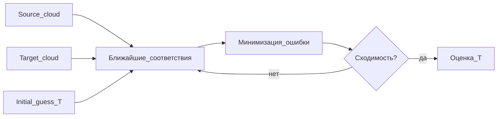

# Direct SLAM: ICP и прямое сопоставление облаков

## Идея подхода

**Direct**-методы работают непосредственно с **геометрией точек** (или локальных поверхностей): ищут преобразование $T \in \mathrm{SE}(3)$, которое лучше всего совмещает два облака или облако с подкартой. Центральный алгоритм — **ICP** (Iterative Closest Point) и его варианты.



## Постановка задачи регистрации

Даны облака $P = \{p_i\}$ (source) и $Q = \{q_j\}$ (target). Нужно найти $R, t$, минимизирующие

$$
\min_{R,t} \sum_i \rho\big(d(T p_i, q_{c(i)}\big)\)
$$

где $T = [R \mid t]$, $c(i)$ — индекс соответствия, $d$ — метрика расстояния, $\rho$ — робастная функция потерь (опционально).

ICP **итеративно**:

1. фиксирует текущую оценку $T$;
2. для каждой точки source находит ближайшую в target (или по нормалям — point-to-plane);
3. решает задачу минимизации для обновления $T$;
4. повторяет до сходимости.

**Важно:** ICP сходится к **локальному** минимуму; нужно **начальное приближение** (identity, константная скорость, IMU, odometry wheel).

## Варианты ICP

### Point-to-Point ICP

Классический вариант: минимизируется **евклидово расстояние** между парами точек.  
Реализация в PCL: `pcl::IterativeClosestPoint`.

| Плюсы | Минусы |
|-------|--------|
| Простота | Медленнее сходимость на плоских поверхностях |
| Не нужны нормали | Менее устойчив на больших плоскостях |

### Point-to-Plane ICP

Расстояние от точки source до **касательной плоскости** в target (нормаль $n_j$):

$$
d = \big( R p_i + t - q_j \big) \cdot n_j
$$

Быстрее сходится, когда поверхности **локально планарны** (лидарные сцены).  
В PCL: нормали через `pcl::NormalEstimation`, регистрация — `pcl::IterativeClosestPointWithNormals` или специализированные классы.

### Generalized ICP (GICP)

Моделирует локальную геометрию **обоих** облаков ковариационными матрицами; по сути **plane-to-plane** в вероятностной постановке (Segal et al., 2009).  
PCL: `pcl::GeneralizedIterativeClosestPoint` — часто **робастнее** классического ICP на KITTI-подобных данных.

### NDT (Normal Distributions Transform)

Представляет target **вокселями** с гауссовыми распределениями; score — вероятность попадания точек source в эти распределения. Не требует явных соответствий точка-точка на каждой итерации.

| | ICP | NDT |
|---|-----|-----|
| Соответствия | Явные nearest neighbor | По ячейкам сетки |
| Сходимость | Зависит от init | Часто шире «бассейн» сходимости |
| PCL | `IterativeClosestPoint`, `GICP` | `pcl::NormalDistributionsTransform` |

### Voxel-based ICP

Облака или карта предварительно **вокселизуют** (центроиды вокселей, surfels, усреднённые нормали). Сопоставление ведёт по **упрощённому** представлению — меньше точек, выше скорость. Тот же приём даёт `pcl::VoxelGrid` при препроцессинге (см. [05-pcl-library.md](05-pcl-library.md)).

**Важно:** voxel downsampling для скорости ≠ voxel **occupancy**-карта (см. [04-voxel-based-slam.md](04-voxel-based-slam.md)).

## LiDAR Odometry через ICP

Типичный цикл по последовательности сканов (например, KITTI):

```
T_0 = I
for k = 0 .. N-1:
    P_k     = load_scan(k)
    P_k+1   = load_scan(k+1)
    P_k'    = preprocess(P_k)
    P_k+1'  = preprocess(P_k+1)
    ΔT      = ICP(P_k+1', P_k', initial_guess=I)   # source→target: движение k→k+1
    T_{k+1} = T_k * ΔT^{-1}   # уточнить направление по конвенции source/target
```

Конвенцию **source/target** и умножение слева/справа нужно зафиксировать в коде и не менять — от этого зависит знак поворота.

### Параметры, влияющие на результат

| Параметр | Эффект |
|----------|--------|
| **Voxel leaf size** | Крупнее → быстрее, грубее; мельче → точнее, риск локальных минимумов |
| **Max correspondence distance** | Отсекает ложные пары; слишком мало — мало пар при быстром движении |
| **Max iterations** | Баланс время/точность |
| **Initial guess** | Без IMU — часто identity достаточен при 10 Hz Velodyne и медленной езде |

## Mapping через direct-накопление

После оценки $\Delta T$ или глобальной $T_k$:

$$
\mathcal{M} = \bigcup_k T_k \cdot P_k'
$$

Простое **склеивание** облаков — прямой mapping без признаков. Проблемы:

- рост памяти;
- «размытие» из-за дрейфа;
- дублирование точек.

**Смягчение:** voxel grid на глобальной карте, периодическое ICP к подкарте (scan-to-map), а не scan-to-scan.

## Scan-to-Scan vs Scan-to-Map

| Режим | Описание |
|-------|----------|
| **Scan-to-scan** | ICP между соседними кадрами; проще, больше дрейф |
| **Scan-to-map** | ICP текущего скана к локальной/глобальной карте; стабильнее на длинных траекториях |

Scan-to-scan проще в реализации; scan-to-map обычно даёт меньший дрейф на длинных траекториях.

## Ограничения direct-подхода

1. **Локальная оптимизация** — плохой init → срыв.
2. **Симметричные сцены** — коридоры, туннели (неоднозначность).
3. **Динамика** — машины вносят ложные соответствия.
4. **Дрейф** без loop closure на длинных маршрутах.

## Реализация в PCL

| Задача | Класс |
|--------|--------|
| Базовый ICP | `pcl::IterativeClosestPoint<PointXYZ, PointXYZ>` |
| С нормалями | `pcl::IterativeClosestPointWithNormals` |
| GICP | `pcl::GeneralizedIterativeClosestPoint` |
| NDT | `pcl::NormalDistributionsTransform` |
| Downsample | `pcl::VoxelGrid` |

Документация: https://pointclouds.org/documentation/group__registration.html

## Краткие выводы

1. Direct LiDAR odometry = **регистрация облаков** + накопление поз.
2. **ICP** — базовый метод; **GICP** и **NDT** часто устойчивее при тех же данных.
3. Препроцессинг (voxel, outlier removal) сильно влияет на сходимость ICP.
4. «Voxel-based ICP» в названии обычно означает **downsampling**, а не occupancy-карту (OctoMap).

## Литература

1. Besl P. J., McKay N. D. A method for registration of 3-D shapes. *IEEE TPAMI*, 1992.
2. Chen Y., Medioni G. Object modelling by registration of multiple range images. *Image and Vision Computing*, 1992 (point-to-plane).
3. Segal A., Haehnel D., Thrun S. Generalized-ICP. *RSS*, 2009.
4. Biber P., Straßer W. The normal distributions transform for registration. *IROS*, 2003 (NDT).
5. PCL Registration module: https://pointclouds.org/documentation/group__registration.html
