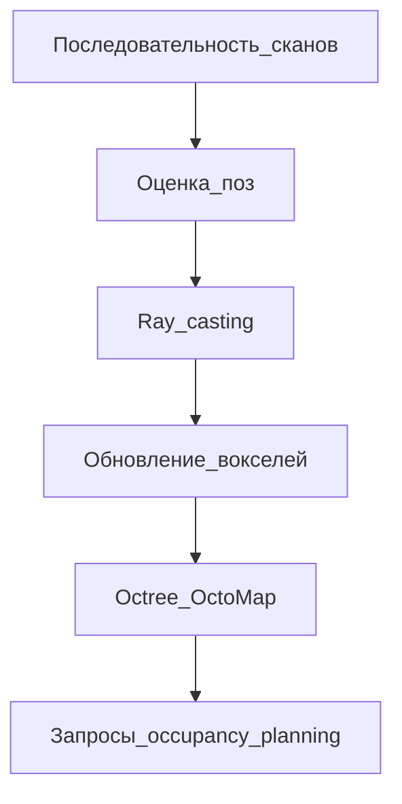

# Voxel-based SLAM и представление карты

## Идея подхода

Вместо хранения **каждой точки** в глобальном облаке среда дискретизируется **3D-сеткой** (вокселями). В каждой ячейке хранится компактная информация: занят/свободен, плотность, расстояние до поверхности, цвет и т.д. Это даёт:

- **эффективную память** (особенно в пустых/open-space сценах);
- **быстрые запросы** occupancy («есть ли препятствие в ячейке?»);
- удобную интеграцию с **планированием пути** и навигацией.

## Типы воксельных представлений

| Тип | Содержимое ячейки | Применение |
|-----|-------------------|------------|
| **Occupancy grid** | Вероятность занятости $p \in [0,1]$ | Навигация, коллизии |
| **TSDF** (Truncated Signed Distance Field) | Расстояние до ближайшей поверхности с знаком | Плотные 3D-модели, RGB-D SLAM (KinectFusion) |
| **Elevation map** | Высота поверхности в 2.5D | Наземная робототехника |
| **Point cloud voxel grid** | Одна усреднённая точка на ячейку | **Downsampling**, не полноценная SLAM-карта |

Последний пункт — то, что делает `pcl::VoxelGrid`: это **не** SLAM-карта в смысле OctoMap, а препроцессинг для ICP (см. [03-direct-slam.md](03-direct-slam.md)).

## OctoMap

**Сайт:** https://octomap.github.io/  
**Статья:** Hornung A. et al., *OctoMap: An Efficient Probabilistic 3D Mapping Framework Based on Octrees*, Autonomous Robots, 2013.

### Octree вместо плоской сетки

**OctoMap** хранит карту в виде **октодерева**: ячейка рекурсивно делится на 8 подъячеек только там, где нужна детализация. В однородном пустом пространстве дерево **сжимается** — экономия памяти по сравнению с плотным 3D-массивом.

### Вероятностная occupancy

Измерения лидара обрабатываются как **лучи** (ray casting): воксели вдоль луча обновляются как **свободные**, воксель в конце — **занятый**. Обновление — **логистическое** (log-odds), что позволяет:

- учитывать шум сенсора;
- интегрировать множество наблюдений;
- моделировать **неизвестность** (unknown voxels).

Класс `octomap::OcTree` — основной тип карты.

### Свойства, важные для SLAM

| Свойство | Описание |
|----------|----------|
| **Multi-resolution** | Обход на разной глубине дерева |
| **Динамическое расширение** | Карта растёт с областью исследования |
| **Сериализация** | Сохранение `.bt` / `.ot` на диск |
| **Интеграция с ROS** | Пакеты `octomap_server`, визуализация в RViz |

Реализация на **C++**, лицензия New BSD; есть **octovis** для 3D-просмотра.

### Типичный цикл обновления

1. Получить скан и позу $T$ (от одометрии / SLAM).
2. Для каждого конечного измерения построить луч от сенсора до точки.
3. `insertRay()` / `updateNode()` — обновить log-odds вдоль луча и в конечной ячейке.
4. `prune()` — сжать дерево при необходимости.

## TSDF и связь с RGB-D SLAM

**Truncated Signed Distance Function** хранит в вокселе приближённое **расстояние до поверхности** (с ограничением по модулю). Популярно в **KinectFusion**, **Voxblox** для дронов и манипуляторов.

Для **вращающегося лидара** на автомобиле чаще используют **occupancy (OctoMap)** или **накопленное облако**, а TSDF — в обзоре как альтернатива для плотного 3D.

## Voxel-based SLAM в широком смысле

Алгоритмы, где **воксельная структура** — ядро карты или оптимизации:

| Система / идея | Роль вокселей |
|----------------|---------------|
| **OctoMap** | Probabilistic 3D occupancy |
| **NDT** | Гауссианы в ячейках для регистрации (см. [03-direct-slam.md](03-direct-slam.md)) |
| **Voxblox / FIESTA** | ESDF для быстрого planning |
| **Voxel hashing** | Плотные TSDF/occupancy без полного octree |

## Сравнение: облако точек vs OctoMap

| Критерий | Накопление point cloud | OctoMap |
|----------|------------------------|---------|
| Память на больших картах | Растёт линейно с числом точек | Часто компактнее в sparse-сценах |
| Визуальная детализация | Высокая (все точки) | Зависит от разрешения листьев |
| Планирование | Нужна доп. обработка | Прямые occupancy-запросы |
| Сложность внедрения | Ниже (PCL merge) | Отдельная библиотека + оценка поз |
| Дрейф | «Двойные стены» | Размытие/фантомы при дрейфе поз |

На практике используют либо **накопление облака**, либо **occupancy-карту** (OctoMap) — в зависимости от задачи (визуализация, планирование, объём памяти).

## Накопление облака точек

$$
P_{\text{global}} \leftarrow P_{\text{global}} \cup T_k \cdot P_k'
$$

Практические приёмы:

- после каждых $N$ кадров применять `VoxelGrid` к $P_{\text{global}}$;
- сохранять карту в `.pcd` порциями;
- не держать все точки в RAM.

## Интеграция OctoMap

Зависимости: библиотека `octomap`, заголовки `octomap/OcTree.h`.

Типичная последовательность:

1. Оценить траекторию (например, ICP-одометрия), получить позы $T_k$.
2. Для каждого скана вызвать `insertPointCloud()` с origin из $T_k$.
3. Сохранить дерево (`.bt`/`.ot`) или просмотреть в **octovis**.

OctoMap не заменяет оценку поз — он потребляет уже вычисленные преобразования (или позы из полноценной SLAM-системы).

## Связь с фильтрацией PCL

| Инструмент | Назначение |
|------------|------------|
| `pcl::VoxelGrid` | Уменьшение числа точек **в скане/карте** |
| `octomap::OcTree` | **Семантика занятости** пространства |

В одной системе часто совмещают оба уровня: `VoxelGrid` при препроцессинге сканов, OctoMap — для хранения карты.

## Краткие выводы

1. **Voxel-based mapping** в SLAM — прежде всего occupancy (OctoMap) и родственные структуры.
2. **`pcl::VoxelGrid`** решает другую задачу: разрежение облака, а не семантика «свободно/занято».
3. **Point cloud merge** проще и нагляднее для визуализации; OctoMap выгоден при навигации и ограничениях по памяти.
4. Качество любой карты ограничено точностью оценки поз.

## Литература и ссылки

1. Hornung A. et al. OctoMap: An Efficient Probabilistic 3D Mapping Framework Based on Octrees. *Autonomous Robots*, 2013.
2. https://octomap.github.io/
3. https://github.com/OctoMap/octomap
4. Oleynikova H. et al. Voxblox: Incremental 3D Euclidean Signed Distance Fields for On-Board MAV Planning. *IROS*, 2017.
5. Newcombe R. A. et al. KinectFusion (TSDF). *ISMAR*, 2011.
