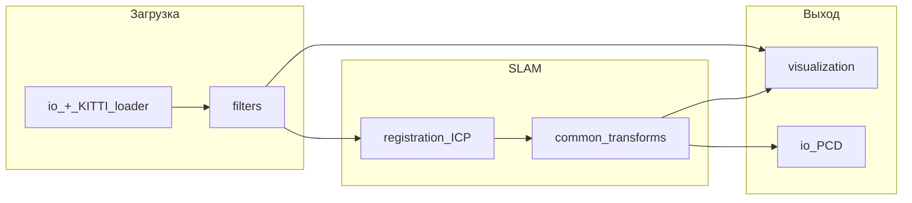

# Point Cloud Library (PCL)

## Обзор

**PCL** (Point Cloud Library) — открытая C++ библиотека для обработки **2D/3D облаков точек**: фильтрация, признаки, регистрация, сегментация, визуализация. Широко используется в робототехнике и лидарном SLAM.

- **Сайт и документация:** [https://pointclouds.org/](https://pointclouds.org/)
- **Оригинальная статья:** Rusu R. B., Cousins S. *3D is here: Point Cloud Library (PCL).* ICRA 2011.
- **Лицензия:** BSD
- **Зависимости:** Eigen, Boost (часто FLANN, VTK для визуализации)

На Arch Linux: пакет `pcl` из любого хелпера AUR (например `paru -S pcl`).

## Архитектура: модули


| Модуль              | Назначение                                                         |
| ------------------- | ------------------------------------------------------------------ |
| **common**          | Типы точек (`PointXYZ`, `PointXYZI`), облака `pcl::PointCloud<T>`  |
| **io**              | Чтение/запись PCD, PLY; загрузчик KITTI `.bin` поверх `PointCloud` |
| **filters**         | VoxelGrid, StatisticalOutlierRemoval, PassThrough                  |
| **registration**    | ICP, GICP, NDT                                                     |
| **features**        | Нормали, FPFH                                                      |
| **segmentation**    | RANSAC плоскостей, кластеризация                                   |
| **visualization**   | PCLVisualizer                                                      |
| **kdtree / search** | Поиск соседей для ICP и нормалей                                   |


Документация по модулям: [https://pointclouds.org/documentation/](https://pointclouds.org/documentation/)

## Базовые типы данных

### Точка и облако

```cpp
#include <pcl/point_cloud.h>
#include <pcl/point_types.h>

pcl::PointCloud<pcl::PointXYZI>::Ptr cloud(new pcl::PointCloud<pcl::PointXYZI>);
// PointXYZI: x, y, z, intensity — удобно для KITTI Velodyne
```

- `width`, `height`: для лидара часто `height=1`, `width=N` (unorganized cloud).
- `is_dense`: false, если есть NaN/Inf.

### Преобразования

```cpp
#include <pcl/common/transforms.h>
Eigen::Matrix4f T = Eigen::Matrix4f::Identity();
pcl::transformPointCloud(*cloud_in, *cloud_out, T);
```

Для SLAM $T$ накапливается из odometry.

## Модуль filters

Документация: [https://pointclouds.org/documentation/group__filters.html](https://pointclouds.org/documentation/group__filters.html)

### VoxelGrid — downsampling

Делит пространство на кубические ячейки (`leaf size`) и заменяет все точки в ячейке **одной** (центроидом).

```cpp
pcl::VoxelGrid<pcl::PointXYZI> vg;
vg.setInputCloud(cloud);
vg.setLeafSize(0.2f, 0.2f, 0.2f);  // метры, подобрать под KITTI
vg.filter(*cloud_filtered);
```


| Параметр         | Рекомендация для KITTI        |
| ---------------- | ----------------------------- |
| `leaf` 0.1–0.2 m | Больше деталей, медленнее ICP |
| `leaf` 0.3–0.5 m | Быстрее, грубее               |


Связанные классы: `ApproximateVoxelGrid` — быстрее, менее точно.

### StatisticalOutlierRemoval (SOR)

Удаляет точки, чье среднее расстояние до k соседей выходит за порог:

```cpp
pcl::StatisticalOutlierRemoval<pcl::PointXYZI> sor;
sor.setInputCloud(cloud);
sor.setMeanK(50);
sor.setStddevMulThresh(1.0);
sor.filter(*cloud_filtered);
```

Полезно для **шума** и изолированных выбросов; на чистом KITTI эффект умеренный.

### PassThrough

Обрезка по оси (часто **z** или радиус) — удаление точек неба/пола вне ROI:

```cpp
pcl::PassThrough<pcl::PointXYZI> pass;
pass.setInputCloud(cloud);
pass.setFilterFieldName("z");
pass.setFilterLimits(-2.0, 2.0);
pass.filter(*cloud_filtered);
```

### Типичная цепочка препроцессинга

```
Load → PassThrough (optional) → VoxelGrid → SOR → [save PCD / visualize]
```

## Модуль registration

Документация: [https://pointclouds.org/documentation/group__registration.html](https://pointclouds.org/documentation/group__registration.html)

### IterativeClosestPoint

```cpp
pcl::IterativeClosestPoint<pcl::PointXYZI, pcl::PointXYZI> icp;
icp.setInputSource(cloud_source);   // кадр k+1
icp.setInputTarget(cloud_target);   // кадр k
icp.setMaxCorrespondenceDistance(1.0);  // м, под сцену
icp.setMaximumIterations(50);
icp.setTransformationEpsilon(1e-6);
icp.align(*cloud_aligned);

if (icp.hasConverged()) {
  Eigen::Matrix4f T = icp.getFinalTransformation();
}
```

**Конвенция:** `align()` возвращает преобразование **source → target**.

### Другие регистраторы


| Класс                              | Когда использовать                             |
| ---------------------------------- | ---------------------------------------------- |
| `GeneralizedIterativeClosestPoint` | Лучшая робастность на структурированных сценах |
| `NormalDistributionsTransform`     | Широкая зона сходимости, другой принцип        |
| `IterativeClosestPointWithNormals` | Point-to-plane при наличии нормалей            |


### Нормали (для GICP / point-to-plane)

```cpp
pcl::NormalEstimation<pcl::PointXYZI, pcl::Normal> ne;
ne.setInputCloud(cloud);
pcl::search::KdTree<pcl::PointXYZI>::Ptr tree(new pcl::search::KdTree<pcl::PointXYZI>);
ne.setSearchMethod(tree);
ne.setKSearch(20);
ne.compute(*normals);
```

## Модуль io


| Формат       | PCL                                              |
| ------------ | ------------------------------------------------ |
| `.pcd`       | `pcl::io::loadPCDFile`, `savePCDFile` — нативный |
| `.ply`       | Поддержка есть                                   |
| KITTI `.bin` | **Свой код:** чтение `float` × 4 на точку        |


Пример логики KITTI (псевдокод):

```cpp
std::ifstream f(path, std::ios::binary);
std::vector<float> buf((std::istreambuf_iterator<char>(f)), {});
size_t n = buf.size() / 4;
cloud->resize(n);
for (size_t i = 0; i < n; ++i) {
  cloud->points[i].x = buf[4*i];
  cloud->points[i].y = buf[4*i+1];
  cloud->points[i].z = buf[4*i+2];
  cloud->points[i].intensity = buf[4*i+3];
}
```

## Модуль visualization

`pcl::visualization::PCLVisualizer` — окно 3D, добавление облаков, осей, траектории.

```cpp
pcl::visualization::PCLVisualizer viewer("Map");
viewer.addPointCloud<pcl::PointXYZI>(cloud, "cloud");
while (!viewer.wasStopped()) {
  viewer.spinOnce(100);
}
```

**VTK** лежит в основе PCL Visualizer; для отдельного UI часто подключают **Qt**. Для быстрого просмотра облаков обычно хватает `PCLVisualizer`.

## Модуль segmentation (обзор)


| Метод                | Класс / идея                                               |
| -------------------- | ---------------------------------------------------------- |
| RANSAC плоскости     | `pcl::SACSegmentation` — выделение земли (как в LeGO-LOAM) |
| Euclidean clustering | `pcl::EuclideanClusterExtraction` — объекты                |


Используется в feature-based пайплайнах (выделение земли, объектов), см. [02-feature-based-slam.md](02-feature-based-slam.md).

## Сборка с CMake

```cmake
cmake_minimum_required(VERSION 3.16)
project(lidar_slam CXX)

set(CMAKE_CXX_STANDARD 17)

find_package(PCL REQUIRED COMPONENTS common io filters registration visualization)

add_executable(app src/main.cpp)
target_include_directories(app PRIVATE ${PCL_INCLUDE_DIRS})
target_link_libraries(app PRIVATE ${PCL_LIBRARIES})
```

`PCL_LIBRARIES` подтягивает зависимости (Eigen, FLANN, VTK и др.).

## Типичная цепочка модулей в LiDAR SLAM




## Полезные туториалы PCL

- Filtering: [https://pcl.readthedocs.io/projects/tutorials/en/latest/voxel_grid.html](https://pcl.readthedocs.io/projects/tutorials/en/latest/voxel_grid.html)
- ICP: [https://pcl.readthedocs.io/projects/tutorials/en/latest/iterative_closest_point.html](https://pcl.readthedocs.io/projects/tutorials/en/latest/iterative_closest_point.html)
- Reading PCD: [https://pcl.readthedocs.io/projects/tutorials/en/latest/reading_pcd.html](https://pcl.readthedocs.io/projects/tutorials/en/latest/reading_pcd.html)

## Краткие выводы

1. PCL покрывает **фильтрацию, регистрацию и визуализацию** лидарных облаков в одном стеке.
2. KITTI `.bin` читают вручную в `PointCloud<PointXYZI>` (нативного reader нет).
3. Базовая одометрия: `VoxelGrid` + `IterativeClosestPoint` или `GICP`.
4. Картирование: `transformPointCloud` и merge в PCD либо передача поз в OctoMap.

## См. также

- [01-slam-basics.md](01-slam-basics.md) — постановка SLAM и KITTI
- [03-direct-slam.md](03-direct-slam.md) — теория ICP
- [04-voxel-based-slam.md](04-voxel-based-slam.md) — OctoMap vs VoxelGrid

